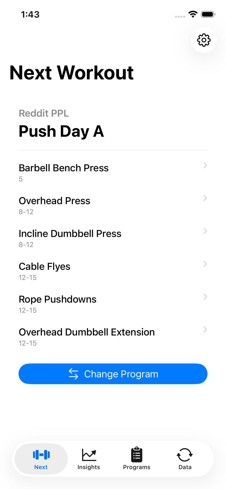
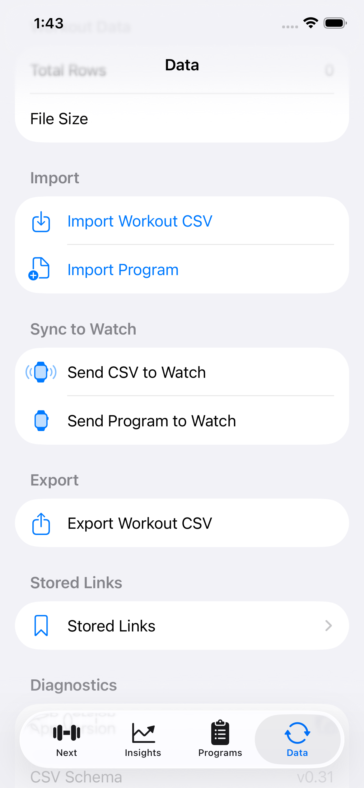
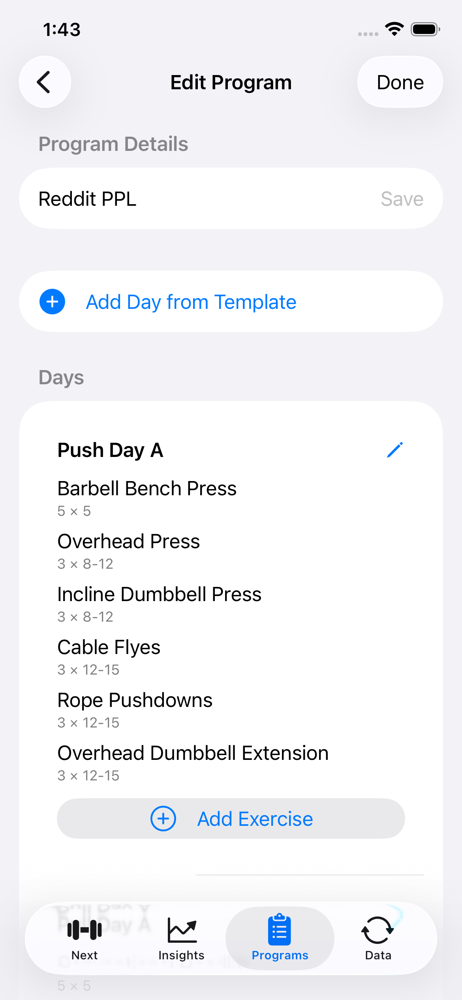
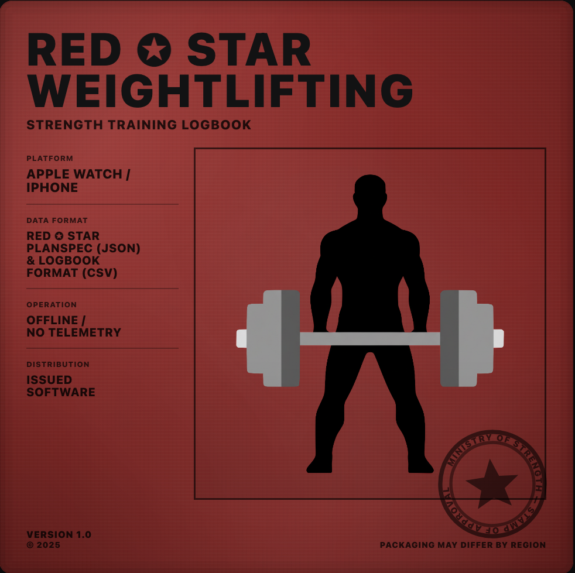

# RED ✪ STAR Weightlifting
Strength is measured, not imagined.

---

## Purpose

RED ✪ STAR Weightlifting is a minimalist, privacy-first, non-commercial anti-feed training log for beginner and intermediate lifters.
No ads, no analytics, no cloud, no external calls, except user-initiated links.
Your data is under your control. Export is a first-class citizen.

Primary instrument: Apple Watch  
iPhone role: dock for planning, review, backup, and export

---

## Requirements

- Apple Watch Series 4 or later (watchOS 11.6+)
- iOS 16+ (Tested on iPhone 12)

RED ✪ STAR Weightlifting can be installed through the Apple App Store.

---

## Philosophy

RED ✪ STAR Weightlifting is designed around a single rule:

**The workout must be executable with only a watch.**

---

## Screenshots

### Primary Instrument

### Dock

---

## Features

- **Log** lifts instantly on your wrist (plan-driven or freestyle)
- **Review** sessions, history, and PRs on iPhone
- Import PLANSPEC JSON plans (subset of v0.4); watch auto-rotates days
- One-tap CSV **export** + full file backups
- 100% **offline-first**
- “Next Up” complication

---

## Data & Privacy

- **No external telemetry**. No ads. No trackers.
- **Open, Documented PLANSPEC JSON-Based Workout Plan Format** We implement and support a subset of the open PLANSPEC specification (currently v0.4).
- **Single append-only Logbook CSV** is the source of truth.
- **Write-ahead log (WAL)** ensures durability on every save.
- **Exports are yours**: the app is designed around easy extraction and reuse of your data.
- **iCloud enabled for user-initiated file export and storage.**
   - If iCloud is disabled or undesirable, you can still choose to export directly to the phone's file folder, or to another app
   - Core logging and training functionality do not depend on iCloud.

---

## In-Universe Briefing

In this world, computing is scarce and power is rationed.  
Machines are judged not by spectacle, but by how little they waste.

RED ✪ STAR Weightlifting follows that tradition: brutalist efficiency, zero telemetry, append-only durable data.

> *“Serve the set. Record the truth. Waste nothing.”*

*The story exists to explain our engineering goals: efficiency, respect for the lifter, and zero compromise on privacy. The framing is fictional, our only affiliation is with the user, not any organization.*

---

---

## Getting Started (Developers)

Build it yourself and avoid the App Store entirely:

1. Open `WEIGHTLIFTING.xcodeproj` in Xcode.
2. Build and run:
   - `WEIGHTLIFTING Watch App` (watchOS target)
   - `WEIGHTLIFTING` (iOS companion target)
3. Optional: add complications/widgets.

You will need to modify the Bundle Identifier and related signing details to run the app locally (sorry).

We cannot offer any support for connecting to the Apple Watch, nor for targeting older versions of the iPhone and Apple Watch due to challenges with Xcode.  We are currently targeting iOS 16 and watchOS 11.6.

---

## Licensing

Dual-licensed:
- GPL-3.0 for open-source use
- Proprietary license for App Store distribution

All contributions must assign copyright to Jawaad Mahmood to preserve future licensing flexibility.
(If you’re uncomfortable with that, kindly open an issue instead of a PR.)

---

## Contributing

See [CONTRIBUTING.md](./CONTRIBUTING.md). Rude or low-effort issues/PRs will be closed without response.

---

## Non-Goals

RED ✪ STAR Weightlifting aims to be a sharp tool, not a social platform.

We intentionally avoid:
- Accounts, feeds, followers, or any cloud-first features.
- Monetization, ads, crash reporting, or behavioral analytics.
- Heavy visualizations that trade battery for aesthetics.

RED ✪ STAR Weightlifting does not support the full PLANSPEC specification.  I have purposely chosen to avoid more esoteric items (choice fields for example) and am focusing on items that I have used as an intermediate trainee.  I may implement them if I can find a good UI paradigm to implement them.

---

## Credits

RED ✪ STAR Weightlifting is authored and maintained by Jawaad Mahmood with AI Assistance.

---

## Glossary

**Apple Watch (Primary Instrument)**
The authoritative execution environment for training. All workouts can be run, logged, and completed using the watch alone.  The Apple Watch is self-sufficient after the workout has been loaded.

**iPhone (Dock)**
A secondary environment used for inspection, aggregation, backup, export, and analysis of data recorded by the watch. Not required for executing workouts.

**Logbook CSV**
The single append-only CSV file that serves as the source of truth for all recorded training data.

**WAL (Write-Ahead Log)**
A durability mechanism that ensures each recorded action is safely persisted before being committed to the Logbook CSV.

**PLANSPEC**
The documented JSON-based workout plan specification used by the application (currently v0.4). Defines exercises, structure, progression, and execution rules.  The specifications are available in the PLANSPEC repository.  I have produced an [editor for Mac and Linux](https://github.com/jmahmood/WEIGHTTRAINING-EDITOR) that you can use to generate your own workout plans.

**Plan Rotation**
The automatic advancement of training days on the watch based on completed sessions, without manual scheduling.

**CLI (Command-Line Interface)**
[A Linux-based command-line implementation](https://github.com/jmahmood/basic_weightlifting) that mirrors all core application operations for plan management and log manipulation.
